---
# try also 'default' to start simple
theme: seriph
# random image from a curated Unsplash collection by Anthony
# like them? see https://unsplash.com/collections/94734566/slidev
background: ./images/hero_image.png
# some information about your slides (markdown enabled)
title: 项目进展
info: |
  多个项目的阶段性成果汇总
# apply UnoCSS classes to the current slide
class: text-center
# https://sli.dev/features/drawing
drawings:
  persist: false
# slide transition: https://sli.dev/guide/animations.html#slide-transitions
transition: slide-left
# enable MDC Syntax: https://sli.dev/features/mdc
mdc: true
---

# 自研硬件体系

  <a href="https://github.com/zhengbi-yong" target="_blank" class="slidev-icon-btn">
    <carbon:logo-github />
  </a>

<!--
The last comment block of each slide will be treated as slide notes. It will be visible and editable in Presenter Mode along with the slide. [Read more in the docs](https://sli.dev/guide/syntax.html#notes)
-->

---

# 目录

<ul class="space-y-3 leading-8">
  <li>
    灵巧手
    — 自研人手尺寸绳驱灵巧手。
  </li>
  <ul class="ml-6 mt-2 list-disc space-y-1"> 
  <li>
    灵巧手-视触觉
    — 全自研装载了视触觉传感器的灵巧手。
  </li>
  </ul>

  <li>
    视触觉传感器-平面
    — 基于 9DTact 研发的平面型视触觉传感器。
  </li>
  <ul class="ml-6 mt-2 list-disc space-y-1"> 
  <li>
    <!-- 这里演示“画圈”动画 -->
    
      视触觉传感器-球面
      <svg class="a-ring__svg" viewBox="0 0 100 40" preserveAspectRatio="none" aria-hidden="true">
        <!-- 用圆角矩形模拟“手绘圈”，pathLength=1 便于统一 dash 动画 -->
        <rect x="2" y="2" width="96" height="36" rx="18" pathLength="1"></rect>
      </svg>
    
    — 基于 PP-Tac 研发的球面型视触觉传感器。
  </li>
  <li>
    视触觉传感器-球面-人手尺寸
    — 全自研人手指尖尺寸视触觉传感器。
  </li>
  </ul>

  <li>
    
      关节电机-中空轴向磁通
      <svg class="a-ring__svg" viewBox="0 0 100 40" preserveAspectRatio="none" aria-hidden="true">
        <rect x="2" y="2" width="96" height="36" rx="18" pathLength="1"></rect>
      </svg>
    
    — 全自研中空外转子轴向磁通电机。
  </li>
</ul>

---

# 友商-灵巧手-舵机直驱

    

        

            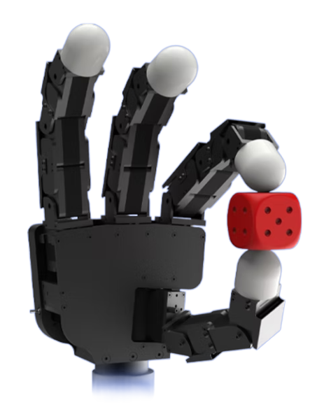
        

        

            Allegro Hand
        

    

  

        

            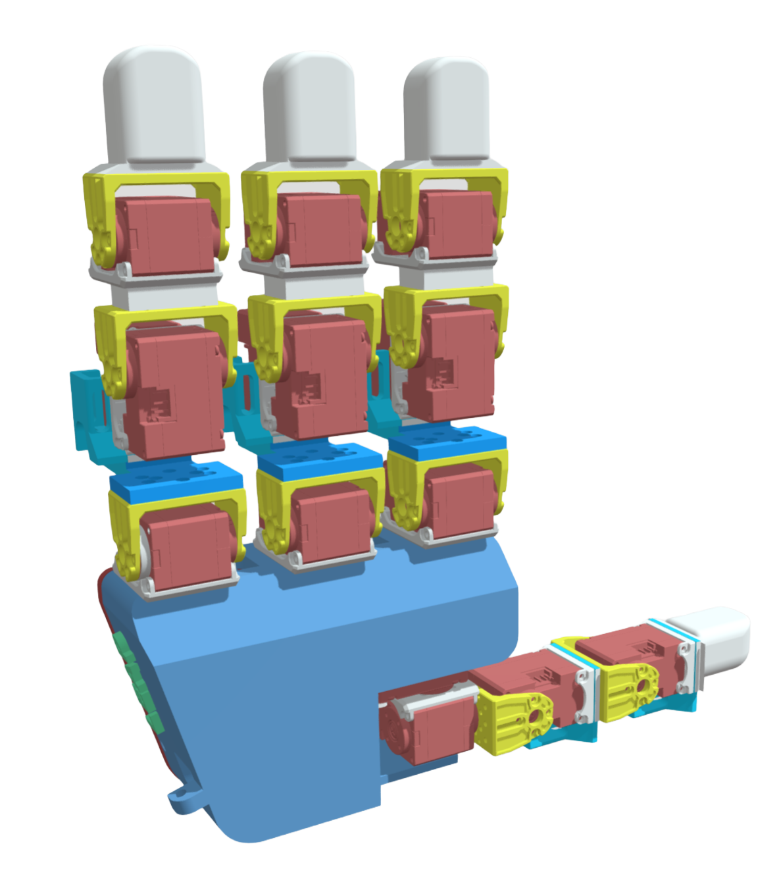
        

        

            LEAP Hand
        

    

---

# 舵机直驱灵巧手缺点

  <!-- 左侧：16:9 容器，竖屏视频完整呈现（letterbox，不裁切） -->
  

    <!-- 关键：用 aspect-[16/9] + object-contain 保证竖屏视频不被裁切 -->
    

      <video
        class="w-full h-full object-contain"
        :src="leapVideo"
        controls
        preload="metadata"
        playsinline
      >
        您的浏览器不支持视频播放。
      </video>
    

  

  <!-- 右侧：文字列表（左右弹簧摆动，缓慢停止） -->
  

    <h2 class="text-xl font-semibold mb-4">直驱的缺点</h2>
    <ul class="list-disc pl-6 space-y-2 leading-7">
      <li v-motion :initial="getSwayInitial(0)" :enter="getSpringSway(0)" class="will-change-transform transform-gpu">
        体积大
      </li>
      <li v-motion :initial="getSwayInitial(1)" :enter="getSpringSway(1)" class="will-change-transform transform-gpu">
        由于体积大一般只有三到四根手指
      </li>
      <li v-motion :initial="getSwayInitial(2)" :enter="getSpringSway(2)" class="will-change-transform transform-gpu">
        指头粗导致精细操作困难
      </li>
      <li v-motion :initial="getSwayInitial(3)" :enter="getSpringSway(3)" class="will-change-transform transform-gpu">
        大电机在手掌上制约设计
      </li>
    </ul>
  

---

# 友商-灵巧手-空心杯

    

        

            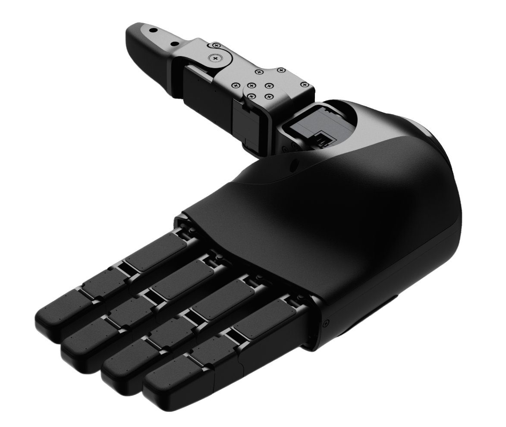
        

        

            宇树 Dex5
        

    

  

        

            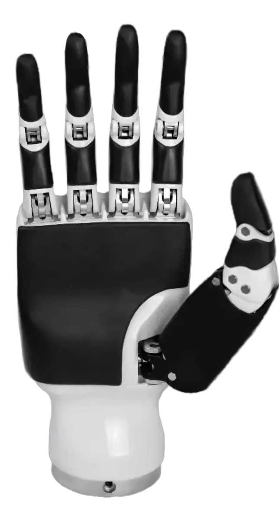
        

        

            因时灵巧手
        

    

---

# 灵巧手

  <!-- 左侧：图片 -->
  

    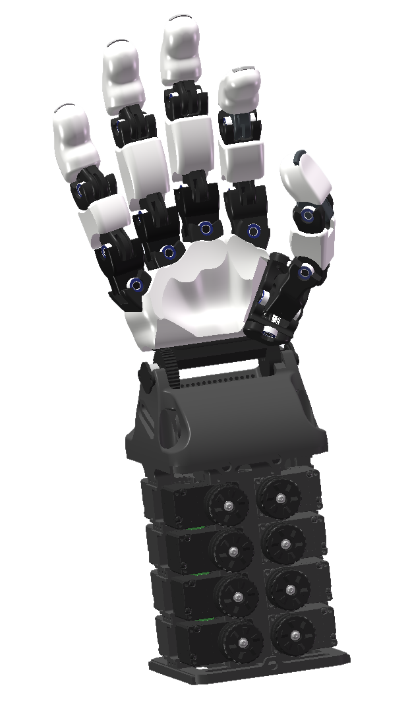
  

  <!-- 右侧：优势（弹簧式左右摆动并逐渐停下） -->
  

    <h2
      v-motion
      :initial="{ opacity: 0, x: -8 }"
      :enter="titleSpring"
      class="text-xl font-semibold mb-4 origin-left will-change-transform transform-gpu"
    >
      优势
    </h2>

  <ul class="list-disc pl-6 space-y-2 leading-7">
      <li v-motion :initial="getSwayInitial(0)" :enter="getSpringSway(6)" class="will-change-transform transform-gpu">性价比高，舵机下移，用便宜舵机获得更大力</li>
      <li v-motion :initial="getSwayInitial(1)" :enter="getSpringSway(6)" class="will-change-transform transform-gpu">绳驱最大化设计自由度</li>
      <li v-motion :initial="getSwayInitial(2)" :enter="getSpringSway(0)" class="will-change-transform transform-gpu">高自由度与精细操控</li>
      <li v-motion :initial="getSwayInitial(3)" :enter="getSpringSway(1)" class="will-change-transform transform-gpu">自适应抓取，适配多形状/材质目标</li>
      <li v-motion :initial="getSwayInitial(4)" :enter="getSpringSway(3)" class="will-change-transform transform-gpu">轻量化与低功耗设计</li>
      <li v-motion :initial="getSwayInitial(5)" :enter="getSpringSway(5)" class="will-change-transform transform-gpu">模块化部件，维护更友好</li>
    </ul>

  

---

# 灵巧手-视触觉

  <!-- 左侧：图片 -->
  

    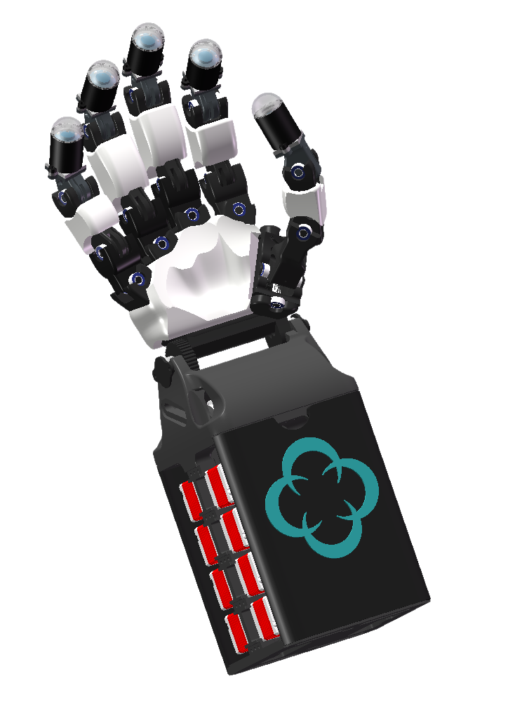
  

  <!-- 右侧：优势（弹簧式左右摆动并逐渐停下） -->
  

    <h2
      v-motion
      :initial="{ opacity: 0, x: -8 }"
      :enter="titleSpring"
      class="text-xl font-semibold mb-4 origin-left will-change-transform transform-gpu"
    >
      优势
    </h2>

  <ul class="list-disc pl-6 space-y-2 leading-7">
      <li v-motion :initial="getSwayInitial(0)" :enter="getSpringSway(6)" class="will-change-transform transform-gpu">五个指尖均有超高精度视触觉传感器</li>
      <li v-motion :initial="getSwayInitial(1)" :enter="getSpringSway(6)" class="will-change-transform transform-gpu">低成本</li>
      <li v-motion :initial="getSwayInitial(2)" :enter="getSpringSway(0)" class="will-change-transform transform-gpu">柔性自适应</li>
    </ul>

  

---

# 自研视触觉灵巧手

  <!-- 可按实际视觉调整 9rem（标题+上下留白的总高度） -->
  <!-- 
 -->
    <video
      class="w-half h-full object-contain rounded-xl shadow-lg"
      :src="leapVideo"
      controls
      preload="metadata"
      playsinline
    >
      您的浏览器不支持视频播放。
    </video>
  <!-- 
 -->

---

# 友商-压阻式触觉传感器

    

        

            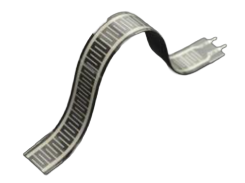
        

        

            条形压阻式传感器
        

    

  

        

            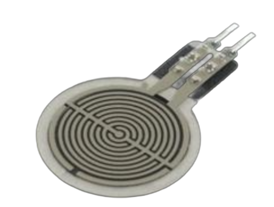
        

        

            圆形压阻式传感器
        

    

---

# 压阻式传感器缺点

      

        

            
        

        

            条形压阻式传感器
        

    

  <!-- 右侧：文字列表（左右弹簧摆动，缓慢停止） -->
  

    <h2 class="text-xl font-semibold mb-4">压阻的缺点</h2>
    <ul class="list-disc pl-6 space-y-2 leading-7">
      <li v-motion :initial="getSwayInitial(0)" :enter="getSpringSway(0)" class="will-change-transform transform-gpu">
        力的维度信息不够丰富
      </li>
      <li v-motion :initial="getSwayInitial(1)" :enter="getSpringSway(1)" class="will-change-transform transform-gpu">
        测量范围有限
      </li>
      <li v-motion :initial="getSwayInitial(2)" :enter="getSpringSway(2)" class="will-change-transform transform-gpu">
        复杂曲面难以贴合
      </li>
      <li v-motion :initial="getSwayInitial(3)" :enter="getSpringSway(3)" class="will-change-transform transform-gpu">
        容易产生机械疲劳然后损坏
      </li>
    </ul>
  

---

# 友商-ITPU

    

        

            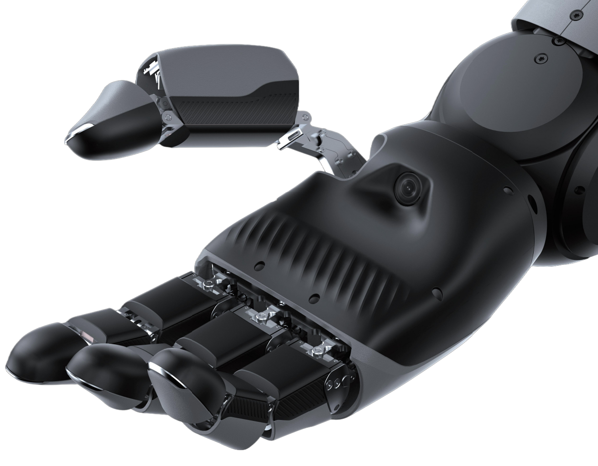
        

        

            ITPU
        

    

  

        

            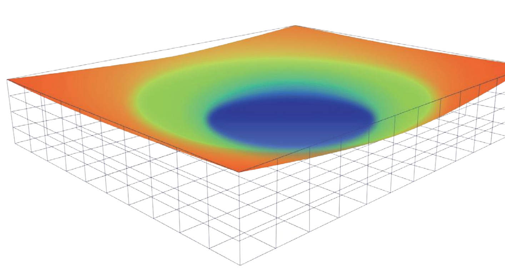
        

        

            ITPU结果
        

    

---

# 视触觉传感器-平面

  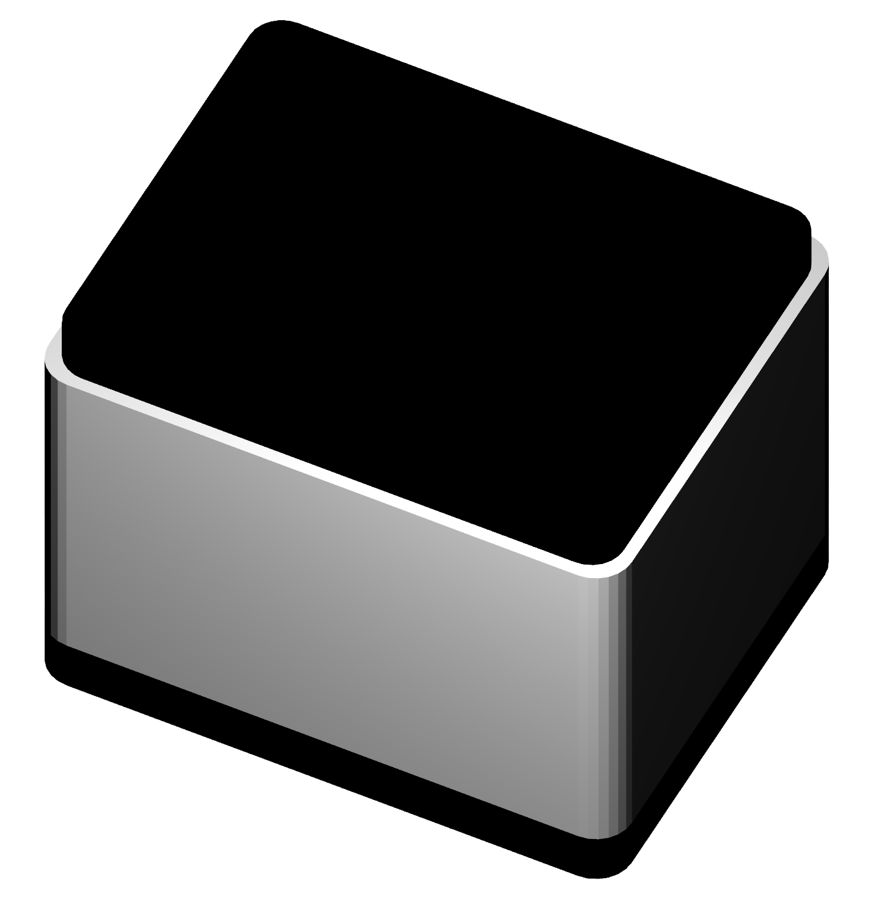

---

# 视触觉传感器-球面

  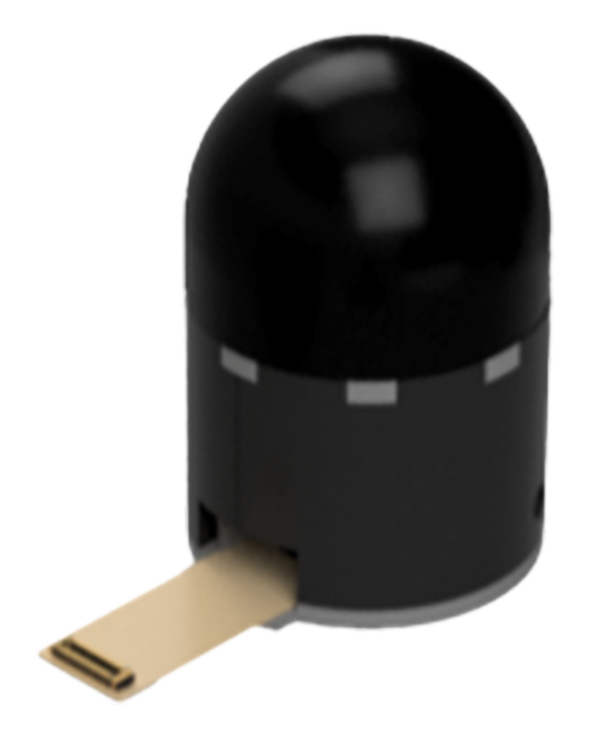

---

# 视触觉传感器-球面-人手尺寸

  

    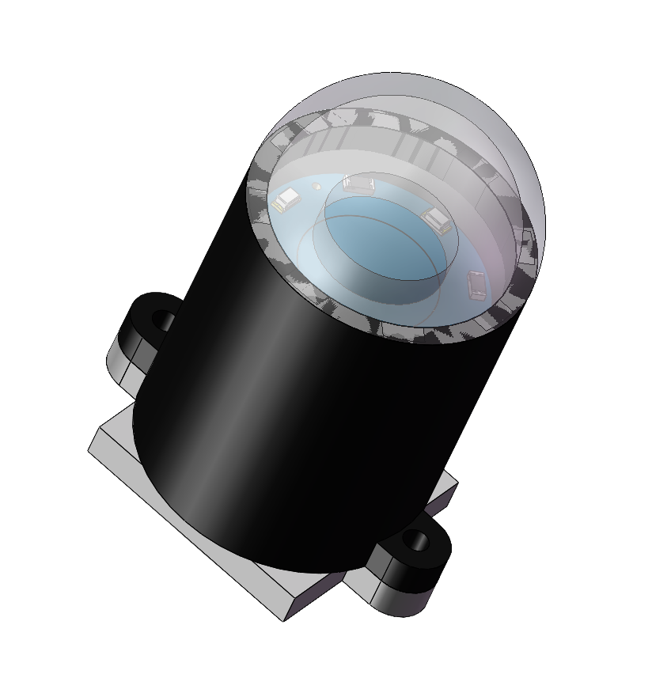
  

  

    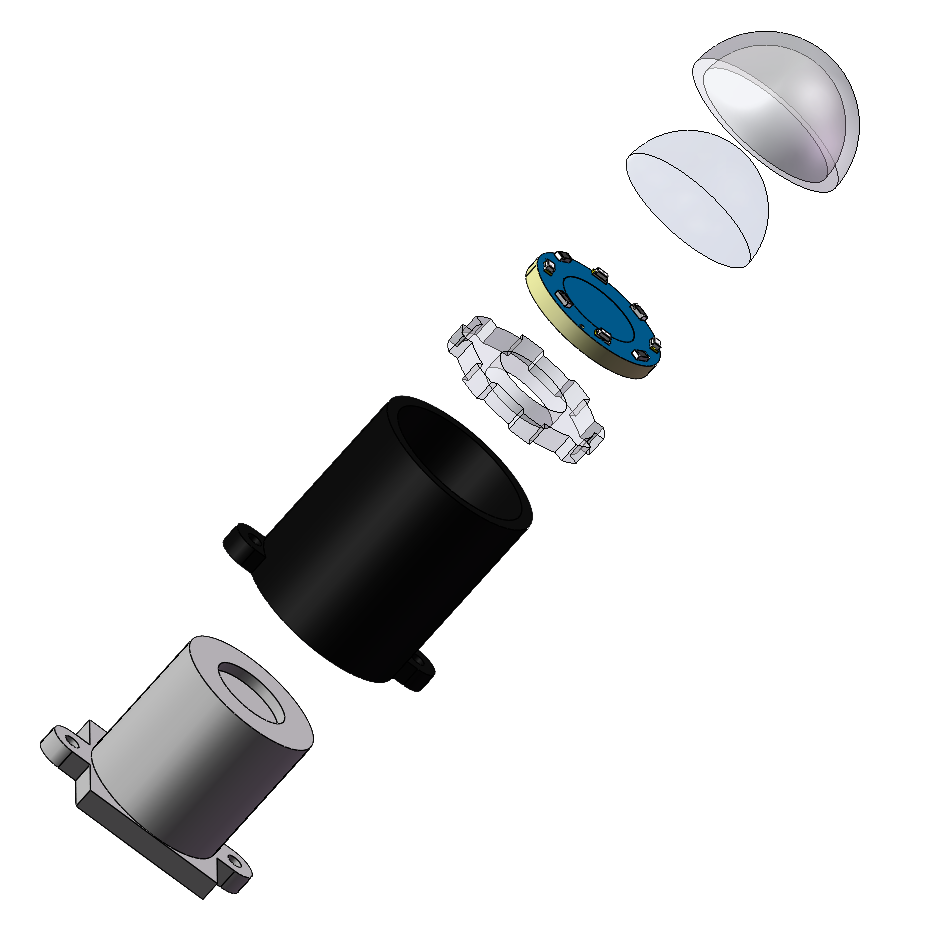
  

---

# 视触觉传感器-球面-人手尺寸

  <!-- 左侧：图片 -->
  

    
  

  <!-- 右侧：优势（弹簧式左右摆动并逐渐停下） -->
  

    <h2
      v-motion
      :initial="{ opacity: 0, x: -8 }"
      :enter="titleSpring"
      class="text-xl font-semibold mb-4 origin-left will-change-transform transform-gpu"
    >
      优势
    </h2>

  <ul class="list-disc pl-6 space-y-2 leading-7">
      <li v-motion :initial="getSwayInitial(0)" :enter="getSpringSway(0)" class="will-change-transform transform-gpu">
        相比压阻提高了  倍
      </li>
      <li v-motion :initial="getSwayInitial(0)" :enter="getSpringSway(0)" class="will-change-transform transform-gpu">
        空间分辨率(面积) 
      </li>
      <li v-motion :initial="getSwayInitial(0)" :enter="getSpringSway(0)" class="will-change-transform transform-gpu">
        空间分辨率(长度) 
      </li>
      <li v-motion :initial="getSwayInitial(1)" :enter="getSpringSway(1)" class="will-change-transform transform-gpu">
        低成本
      </li>
      <li v-motion :initial="getSwayInitial(2)" :enter="getSpringSway(2)" class="will-change-transform transform-gpu">
        柔性自适应
      </li>
      <li v-motion :initial="getSwayInitial(2)" :enter="getSpringSway(2)" class="will-change-transform transform-gpu">
        算法可复用已经高度发展的CV领域的所有算法，例如ResNet、DenseNet、SwinTransformer、VisionMamba……
      </li>
    </ul>

  

---

# 自研人手指尺寸视触觉传感器

  <!-- 可按实际视觉调整 9rem（标题+上下留白的总高度） -->
  <!-- 
 -->
    <video
      class="w-half h-full object-contain rounded-xl shadow-lg"
      :src="leapVideo"
      controls
      preload="metadata"
      playsinline
    >
      您的浏览器不支持视频播放。
    </video>
  <!-- 
 -->

---

# 自研关节电机-轴向磁通电机

  <!-- 左侧：图片 -->
  

    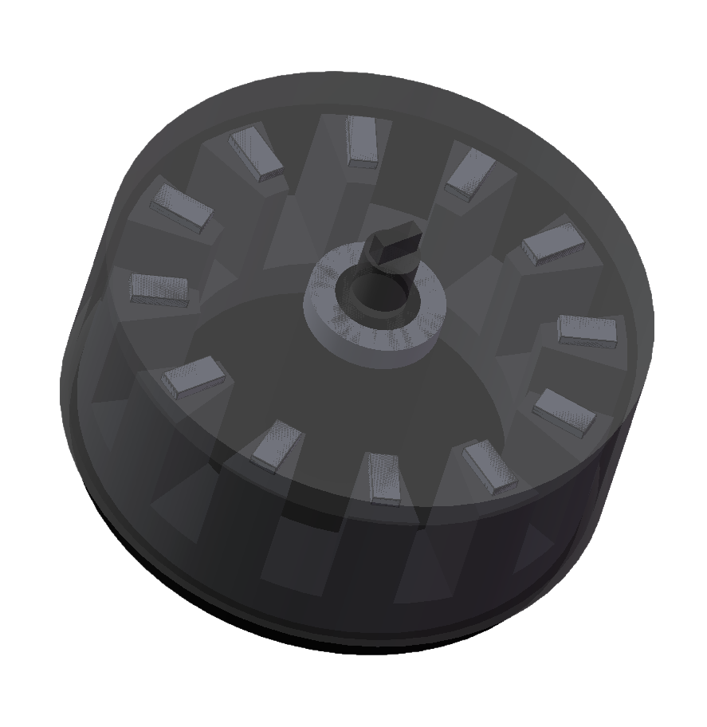
  

  <!-- 右侧：优势（弹簧式左右摆动并逐渐停下） -->
  

    <h2
      v-motion
      :initial="{ opacity: 0, x: -8 }"
      :enter="titleSpring"
      class="text-xl font-semibold mb-4 origin-left will-change-transform transform-gpu"
    >
      优势
    </h2>

  <ul class="list-disc pl-6 space-y-2 leading-7">
      <li v-motion :initial="getSwayInitial(0)" :enter="getSpringSway(0)" class="will-change-transform transform-gpu">
        功率密度高，在机器人典型应用场景中同体积下力矩是径向磁通的三倍
      </li>
      <li v-motion :initial="getSwayInitial(1)" :enter="getSpringSway(0)" class="will-change-transform transform-gpu">
        充分利用磁场，提高效率
      </li>
      <li v-motion :initial="getSwayInitial(2)" :enter="getSpringSway(0)" class="will-change-transform transform-gpu">
        自定义体积和力矩，软硬一体化设计，更有利于节能和节省冗余设计
      </li>
    </ul>

  

---

# 自研关节电机-轴向磁通电机-原理

- 更大的有效转矩臂

$$
T=F \times r
$$

- 磁路更短，磁通利用率高

- 铜损更低，散热面积大

- 可模块化叠盘结构

$$
P\propto n盘​
$$

> 磁路短、转矩臂长、磁通利用率高、导线更短

---

# 自研关节电机-未来-中空轴向磁通电机

  <!-- 左侧：图片 -->
  

    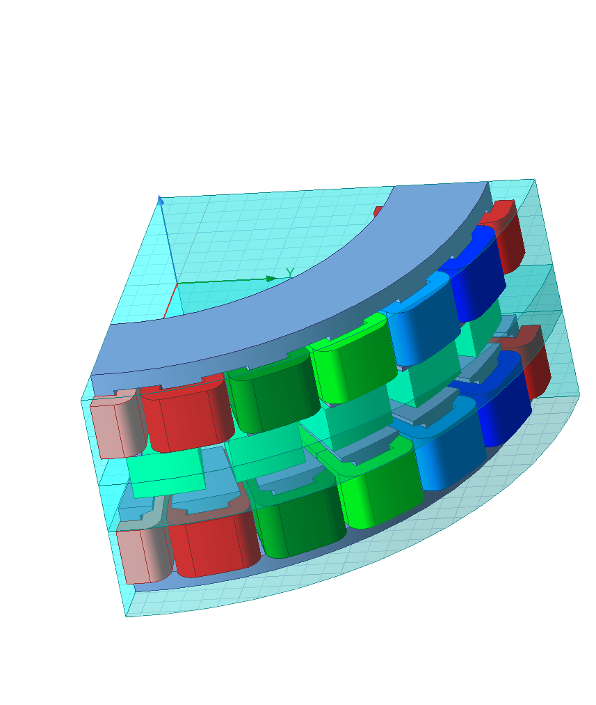
  

  <!-- 右侧：优势（弹簧式左右摆动并逐渐停下） -->
  

    <h2
      v-motion
      :initial="{ opacity: 0, x: -8 }"
      :enter="titleSpring"
      class="text-xl font-semibold mb-4 origin-left will-change-transform transform-gpu"
    >
      优势
    </h2>

  <ul class="list-disc pl-6 space-y-2 leading-7">
      <li v-motion :initial="getSwayInitial(0)" :enter="getSpringSway(0)" class="will-change-transform transform-gpu">
        参数化建模和设计，快速迭代，广泛适配
      </li>
      <li v-motion :initial="getSwayInitial(1)" :enter="getSpringSway(0)" class="will-change-transform transform-gpu">
        中空便于机器人走线，使机器人更美观
      </li>
    </ul>

  

