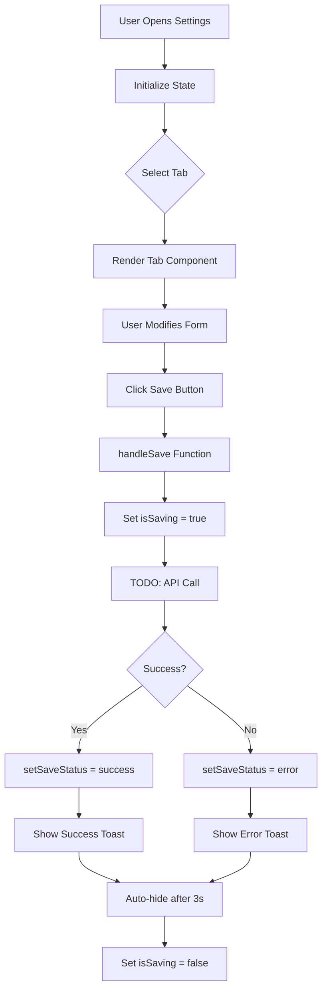

# Settings Module

## Overview

This module implements a comprehensive system settings page with tabbed navigation for managing site configuration, email settings, security policies, and performance optimization. It provides a production-ready UI for administrators to configure various system parameters.

**Purpose**: Centralized system configuration management.

**Key Features**:
- Tabbed navigation (4 sections)
- Form controls with validation
- Save status feedback (success/error)
- Loading states during save
- Dark mode support
- Organized by category (General, Email, Security, Performance)

## Component Structure

### SettingsPage (Main)

**Location**: `page.tsx` (lines 13-111)

**Purpose**: Container component managing tab state and save operations.

**State Management**:
```typescript
const [activeTab, setActiveTab] = useState<TabType>('general')
const [isSaving, setIsSaving] = useState(false)
const [saveStatus, setSaveStatus] = useState<'idle' | 'success' | 'error'>('idle')
```

**Tab Configuration**:
```typescript
type TabType = 'general' | 'email' | 'security' | 'performance'

const tabs = [
  { id: 'general', label: '常规设置', icon: Globe },
  { id: 'email', label: '邮件配置', icon: Mail },
  { id: 'security', label: '安全设置', icon: Shield },
  { id: 'performance', label: '性能优化', icon: Zap },
]
```

**UI Structure**:
1. Header (title + save button)
2. Save status notifications
3. Tab navigation bar
4. Tab content area (conditional rendering)

### Tab Components

#### 1. GeneralSettings

**Location**: `page.tsx` (lines 114-184)

**Purpose**: Site configuration and SEO settings.

**Form Fields**:
1. **站点名称** (Site Name) - Text input
   - Default: "Zhengbi Yong's Blog"
2. **站点描述** (Site Description) - Textarea (3 rows)
   - Default: "个人博客和技术分享平台"
3. **站点 URL** (Site URL) - URL input
   - Default: "https://yourdomain.com"
4. **默认 Meta 标题** (Meta Title) - Text input
5. **默认 Meta 描述** (Meta Description) - Textarea (3 rows)

**Sections**:
- 站点配置 (Site Configuration)
- SEO 设置 (SEO Settings)

#### 2. EmailSettings

**Location**: `page.tsx` (lines 187-268)

**Purpose**: SMTP email server configuration.

**Form Fields**:
1. **SMTP 主机** (SMTP Host) - Text input
   - Default: "smtp.gmail.com"
2. **SMTP 端口** (SMTP Port) - Number input
   - Default: "587"
3. **发件人邮箱** (Sender Email) - Email input
   - Default: "noreply@example.com"
4. **SMTP 用户名** (SMTP Username) - Text input
   - Default: "your-email@gmail.com"
5. **SMTP 密码** (SMTP Password) - Password input
   - Placeholder: "••••••••"
6. **启用 TLS/SSL** (Enable TLS) - Checkbox
   - Default: checked

**Actions**:
- "发送测试邮件" (Send Test Email) button

#### 3. SecuritySettings

**Location**: `page.tsx` (lines 271-372)

**Purpose**: Password policies and login restrictions.

**Sections**:

**Password Policy (密码策略)**:
1. **最小密码长度** (Min Password Length) - Number input
   - Default: 8
   - Range: 6-32
2. **要求包含大写字母** (Require Uppercase) - Checkbox
   - Default: checked
3. **要求包含小写字母** (Require Lowercase) - Checkbox
   - Default: checked
4. **要求包含数字** (Require Numbers) - Checkbox
   - Default: checked
5. **要求包含特殊字符** (Require Symbols) - Checkbox
   - Default: unchecked

**Login Restrictions (登录限制)**:
1. **最大登录尝试次数** (Max Login Attempts) - Number input
   - Default: 5
   - Range: 3-10
2. **锁定时间（分钟）** (Lockout Duration) - Number input
   - Default: 15
   - Range: 5-60

#### 4. PerformanceSettings

**Location**: `page.tsx` (lines 375-461)

**Purpose**: Caching, CDN, and database optimization settings.

**Sections**:

**Cache Configuration (缓存配置)**:
1. **缓存过期时间（秒）** (Cache TTL) - Number input
   - Default: 3600 (1 hour)
   - Range: 60-86400
2. **启用缓存** (Enable Cache) - Checkbox
   - Default: checked

**CDN Configuration (CDN 配置)**:
1. **CDN 域名** (CDN Domain) - URL input
   - Placeholder: "https://cdn.yourdomain.com"
2. **启用 CDN** (Enable CDN) - Checkbox
   - Default: unchecked

**Database Optimization (数据库优化)**:
1. **连接池大小** (Connection Pool Size) - Number input
   - Default: 10
   - Range: 5-50
2. **优化数据库** (Optimize Database) button

## Styling

**Approach**: Tailwind CSS with comprehensive dark mode support

**Color Scheme**:
- Primary: Blue-600/Blue-400
- Success: Green-50/Green-800 (dark: Green-900/20)
- Error: Red-50/Red-800 (dark: Red-900/20)
- Text: Gray-900/Gray-600 (dark: White/Gray-400)
- Border: Gray-300 (dark: Gray-600)
- Background: White (dark: Gray-800)

**Component Styling**:
- **Tabs**: Border-bottom-2, transition-colors
- **Active Tab**: border-blue-500, text-blue-600
- **Inactive Tab**: border-transparent, text-gray-500
- **Inputs**: focus:ring-2, focus:ring-blue-500
- **Buttons**: hover transitions, disabled states

## State Management

### Save Operation

```typescript
const handleSave = async () => {
  setIsSaving(true)
  setSaveStatus('idle')

  try {
    // TODO: 实现保存逻辑
    await new Promise(resolve => setTimeout(resolve, 1000))
    setSaveStatus('success')
    setTimeout(() => setSaveStatus('idle'), 3000)
  } catch (error) {
    setSaveStatus('error')
    setTimeout(() => setSaveStatus('idle'), 3000)
  } finally {
    setIsSaving(false)
  }
}
```

**Flow**:
1. Set saving state
2. Simulate API call (1 second delay)
3. Set success status
4. Auto-hide after 3 seconds

### Save Status Feedback

**Success State**:
```typescript
{saveStatus === 'success' && (
  <div className="bg-green-50 dark:bg-green-900/20 border-green-200">
    <CheckCircle2 className="text-green-600" />
    <span>设置已保存</span>
  </div>
)}
```

**Error State**:
```typescript
{saveStatus === 'error' && (
  <div className="bg-red-50 dark:bg-red-900/20 border-red-200">
    <AlertCircle className="text-red-600" />
    <span>保存失败，请重试</span>
  </div>
)}
```

## Data Flow



## Form Validation

**Input Types**:
- `type="text"` - General text fields
- `type="url"` - URL validation
- `type="email"` - Email format validation
- `type="number"` - Numeric constraints (min/max)
- `type="password"` - Masked input
- `type="checkbox"` - Boolean toggles

**Constraints**:
- Min/max validation on number inputs
- Required field handling (implied)
- Placeholder text for password fields

## Dependencies

### External
- `lucide-react` - Icons (Save, Mail, Shield, Globe, Zap, AlertCircle, CheckCircle2)

### Internal
- None (standalone component)

## Accessibility

**Features**:
- Semantic HTML (labels, inputs, buttons)
- Icon + text labels for clarity
- Focus states (ring-2 ring-blue-500)
- Disabled button states with visual feedback
- ARIA-compatible structure (labels linked to inputs via htmlFor)
- Color contrast (WCAG AA compliant)

## Known Issues

1. **Save Not Implemented**: `handleSave` contains TODO comment - no actual API integration
2. **No Form Validation**: Client-side validation not implemented
3. **State Not Persisted**: Form values not saved to state
4. **No Confirmation**: Destructive actions lack confirmation dialogs
5. **No Undo**: Changes applied immediately without preview/confirm

## Future Enhancements

- [ ] Implement actual API save endpoints
- [ ] Add form validation (required fields, format checks)
- [ ] Add confirmation dialogs for destructive changes
- [ ] Implement preview/apply workflow
- [ ] Add reset to defaults button
- [ ] Implement per-field save status indicators
- [ ] Add configuration import/export
- [ ] Add version history/rollback
- [ ] Implement field-level permissions (admin only)
- [ ] Add live preview for site changes
- [ ] Add email testing with real send
- [ ] Add security audit log
- [ ] Add performance monitoring dashboard
- [ ] Add configuration validation before save

## Integration Points

**API Endpoints Needed**:
- `PUT /api/settings/general` - General settings
- `PUT /api/settings/email` - Email configuration
- `PUT /api/settings/security` - Security policies
- `PUT /api/settings/performance` - Performance settings
- `POST /api/settings/email/test` - Test email
- `POST /api/settings/database/optimize` - Optimize database

**Data Model**:
```typescript
interface Settings {
  general: {
    siteName: string
    siteDescription: string
    siteUrl: string
    metaTitle: string
    metaDescription: string
  }
  email: {
    smtpHost: string
    smtpPort: number
    senderEmail: string
    smtpUsername: string
    smtpPassword: string
    enableTls: boolean
  }
  security: {
    minPasswordLength: number
    requireUppercase: boolean
    requireLowercase: boolean
    requireNumbers: boolean
    requireSymbols: boolean
    maxLoginAttempts: number
    lockoutDuration: number
  }
  performance: {
    cacheTtl: number
    enableCache: boolean
    cdnDomain: string
    enableCdn: boolean
    connectionPoolSize: number
  }
}
```
