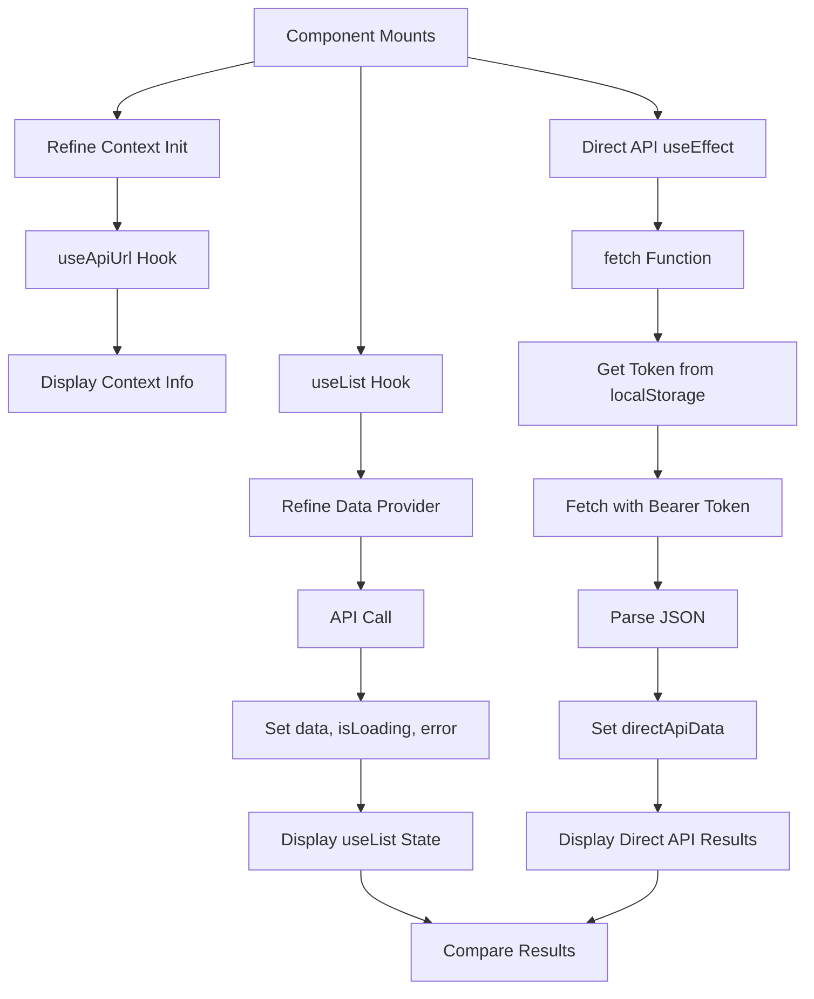

# Admin Test Module

## Overview

This module provides a comprehensive testing/debugging page for validating Refine.dev integration, API connectivity, and authentication in the admin panel. It performs side-by-side comparisons of Refine `useList` hook vs direct API calls to diagnose integration issues.

**Purpose**: Debug and validate Refine + API integration in admin dashboard.

**Key Features**:
- Refine context validation (`useApiUrl`)
- Direct API testing (bypassing Refine)
- useList hook state inspection
- Side-by-side data comparison
- Logout functionality
- Comprehensive logging

## Component

### AdminTestPage

**Location**: `page.tsx`

**Purpose**: Testing/diagnostics page for Refine integration issues.

**Props**: None

**State Management**:
```typescript
const [directApiData, setDirectApiData] = useState<any>(null)
const [refineContextTest, setRefineContextTest] = useState<any>(null)
```

**Hook Usage**:
```typescript
// Refine context test
const apiUrl = useApiUrl()

// Refine data fetching test
const queryResult = useList({
  resource: 'admin/posts',
  pagination: {
    current: 1,
    pageSize: 20,
  } as any,
})

// Logout test
const { mutate: logout } = useLogout()
```

## Test Sections

### 1. Refine Context Test

**Purpose**: Validate Refine provider is properly configured.

**Tests**:
- `hasApiUrl`: Boolean check if apiUrl exists
- `apiUrl`: Display actual API URL value

**Expected Behavior**:
- Should show apiUrl defined (e.g., "http://localhost:3000/v1")
- Green background panel indicates test section

### 2. Direct API Test

**Purpose**: Verify API connectivity without Refine abstraction.

**Implementation**:
```typescript
// GOLDEN_RULES 1.1: 使用 credentials: 'include' 发送 HttpOnly Cookie
useEffect(() => {
  const fetchDirect = async () => {
    const response = await fetch('http://localhost:3000/v1/admin/posts?page=1&page_size=20', {
      headers: {
        'Content-Type': 'application/json',
      },
      credentials: 'include',
    })
    const result = await response.json()
    setDirectApiData(result)
  }
  fetchDirect()
}, [])
```

**Tests**:
- `hasData`: Boolean check if data returned
- `posts count`: Number of posts in array
- `total`: Total count from API

**Expected Behavior**:
- Should fetch successfully if HttpOnly cookie is valid
- Green background panel indicates test section

### 3. useList State Test

**Purpose**: Inspect Refine's `useList` hook internal state.

**Tests**:
- `isLoading`: Loading state
- `hasError`: Error presence
- `hasData`: Data availability
- `dataKeys`: Object.keys(data) inspection
- `data.data`: Type and structure check
- `data.total`: Total count field

**Data Structure Display**:
```typescript
{
  isLoading: boolean
  hasError: boolean
  hasData: boolean
  dataKeys: string[]
  data.data: "Array(N)" | typeof
  data.total: number
}
```

**Expected Behavior**:
- Should match direct API data structure
- White background panel for neutral display

### 4. Data Comparison

**Purpose**: Compare Refine data vs direct API data.

**Display**:
- First 3 posts from useList (JSON formatted)
- First 3 posts from direct API (JSON formatted)
- Side-by-side comparison of structure

**Expected Behavior**:
- Both should show identical post objects
- JSON formatting reveals field structure

## API Integration

### Direct API Call

**Endpoint**: `http://localhost:3000/v1/admin/posts`

**Method**: GET

**Authentication**:
```typescript
// GOLDEN_RULES 1.1: 使用 credentials: 'include' 发送 HttpOnly Cookie
headers: {
  'Content-Type': 'application/json',
},
credentials: 'include'
```

**Query Parameters**:
```typescript
?page=1&page_size=20
```

### Refine useList Hook

**Resource**: `admin/posts`

**Pagination**:
```typescript
{
  current: 1,
  pageSize: 20,
}
```

**Data Extraction Pattern**:
```typescript
const queryResult = useList({...})
const query = queryResult.query
const result = queryResult.result
const data = result?.data
const isLoading = query?.isPending
const error = query?.isError ? query.error : undefined
```

## Data Structure

### Expected Response Format

```typescript
interface ApiResponse {
  posts: Post[]
  total: number
}

interface Post {
  slug: string
  view_count: number
  like_count: number
  comment_count: number
  updated_at: string
}
```

### Refine Data Structure

```typescript
interface RefineResponse {
  data: Post[]
  total: number
}
```

## Styling

**Approach**: Tailwind CSS with color-coded test sections

**Section Colors**:
- Refine Context: `bg-blue-50` (blue - informational)
- Direct API: `bg-green-50` (green - success/external)
- useList State: `bg-white` (white - neutral)
- Data Display: `bg-white` (white - data focus)

**Typography**:
- Headers: `text-xl font-semibold`
- Monospace data: `font-mono text-sm`
- Bold values: `font-bold`

## Data Flow



## Logging

**Debug Points**:
1. Refine Context Test:
```typescript
logger.log('[AdminTest] Refine Context Test:', {
  hasApiUrl: !!apiUrl,
  apiUrl,
  contextTest: refineContextTest,
})
```

2. useList Result:
```typescript
logger.log('[AdminTest]', {
  data,
  isLoading,
  error,
  dataKeys: data ? Object.keys(data) : 'no data',
  dataArray: data,
})
```

3. Direct API:
```typescript
logger.log('[Direct API] Result:', result)
logger.error('[Direct API] Error:', err)
```

## Test Scenarios

### Scenario 1: Valid Refine Setup
**Expected**:
- apiUrl displayed
- useList returns data
- Direct API returns data
- Both data sources match

### Scenario 2: Auth Failure
**Expected**:
- useList shows error
- Direct API shows error
- Data arrays empty

### Scenario 3: Refine Data Provider Issue
**Expected**:
- apiUrl displayed (context OK)
- useList fails/malformed
- Direct API succeeds (confirms API is OK)

## Known Issues

1. **@ts-nocheck**: File bypasses TypeScript checking
2. **Debug Page**: Not intended for production use
3. **Hardcoded URL**: Direct API uses localhost:3000
4. **No Error Actions**: Errors displayed but not actionable
5. **Manual Refresh**: No auto-refresh or re-test button

## Dependencies

### External
- `@refinedev/core` - useList, useLogout, useApiUrl hooks

### Internal
- `@/lib/utils/logger` - Debug logging

## Usage

### When to Use This Page

1. **Initial Setup**: Verify Refine provider is configured correctly
2. **Debug Data Issues**: Compare Refine vs direct API responses
3. **Auth Testing**: Verify token-based authentication works
4. **Integration Issues**: Diagnose Refine data provider problems

### How to Interpret Results

**All Green + Data Matches**: Refine integration working correctly
**Direct API Works, useList Fails**: Refine data provider issue
**Both Fail**: Authentication or API connectivity issue
**Missing apiUrl**: Refine provider not configured

## Future Enhancements

- [ ] Add re-test button for all tests
- [ ] Add network request timing comparison
- [ ] Add error code lookup/documentation links
- [ ] Add test export (share debug info)
- [ ] Add authentication token display (masked)
- [ ] Add Refine data provider configuration display
- [ ] Add test history/previous runs
- [ ] Add automated test suite (run all tests)
- [ ] Add performance metrics (render time, fetch time)
- [ ] Add environment info display
- [ ] Remove from production builds (dev-only)

## Differences from Production Pages

| Feature | Test Page | Production Pages |
|---------|-----------|------------------|
| Purpose | Debug/diagnostics | User functionality |
| Logging | Extensive | Minimal |
| Data display | JSON/raw | Formatted UI |
| Styling | Color-coded by section | Consistent theme |
| Error handling | Display only | User-friendly messages |
| TypeScript | @ts-nocheck | Proper types |
| URL | Hardcoded localhost | Configurable |
| Refine vs Direct | Both compared | Refine only |
