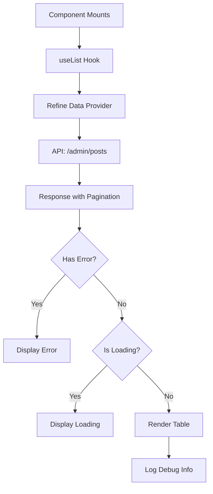

# Posts Refine Module

## Overview

This module implements an admin panel for managing blog posts using Refine.dev's `useList` hook. It provides a simple table view of posts with statistics (views, likes, comments) fetched from the Payload CMS backend via Refine's data provider.

**Purpose**: Demonstrate Refine integration for CRUD operations in admin dashboard.

**Key Features**:
- Refine `useList` hook for data fetching
- Pagination support (20 items per page)
- Post statistics display
- Comprehensive logging for debugging

## Component

### PostsRefinePage

**Location**: `page.tsx`

**Purpose**: Display paginated list of posts with engagement metrics.

**Props**: None

**State**: None (uses Refine's reactive data)

**Hook Usage**:
```typescript
const queryResult = useList({
  resource: 'admin/posts',
  pagination: {
    current: 1,
    pageSize: 20,
  },
  queryOptions: {
    enabled: true,
    staleTime: 0,
    refetchOnWindowFocus: false,
  },
})
```

**Data Structure**:
```typescript
interface Post {
  slug: string
  view_count: number
  like_count: number
  comment_count: number
}
```

**UI Structure**:
1. Loading state → "Loading..." message
2. Error state → Red error message
3. Success state → Table with:
   - Slug column
   - View count (with Eye icon)
   - Like count (with Heart icon)
   - Comment count (with MessageSquare icon)

## Styling

**Approach**: Tailwind CSS utility classes

**Key Classes**:
- Layout: `p-8 space-y-6` (container with vertical spacing)
- Table: `bg-white rounded shadow overflow-hidden`
- Header: `text-3xl font-bold`
- Debug panel: `bg-blue-50 p-4 rounded`

## API Integration

**Endpoint**: `admin/posts` (via Refine data provider)

**Method**: GET

**Authentication**: Handled by Refine data provider

**Response Format**:
```typescript
{
  data: Post[],
  total: number
}
```

**Error Handling**: Displays error message from `query.error`

## Dependencies

### External
- `@refinedev/core` - useList hook for data fetching
- `lucide-react` - Icons (FileText, Eye, Heart, MessageSquare)

### Internal
- `@/lib/utils/logger` - Debug logging

## Data Flow



## Logging

**Debug Points**:
1. Component render: `[PostsRefine] Component rendering`
2. useList result: Full query result with data structure inspection
3. Property enumeration: All available properties

**Logger Usage**:
```typescript
logger.log('[PostsRefine] useList result:', {
  data, isLoading, error,
  dataType: typeof data,
  dataKeys: data ? Object.keys(data) : 'no data',
  dataLength: data?.length,
  total: result?.total,
})
```

## Known Issues

1. **@ts-nocheck**: File uses `// @ts-nocheck` to bypass TypeScript checks - indicates type definitions may be incomplete
2. **Debug code**: Extensive logging suggests this is a testing/development implementation
3. **Hardcoded pagination**: Page size and current page are hardcoded

## Future Enhancements

- [ ] Add sorting functionality
- [ ] Implement row actions (edit, delete, preview)
- [ ] Add search/filter capabilities
- [ ] Remove @ts-nocheck and add proper types
- [ ] Extract debug logging to development-only builds
- [ ] Add pagination controls
- [ ] Implement optimistic updates
