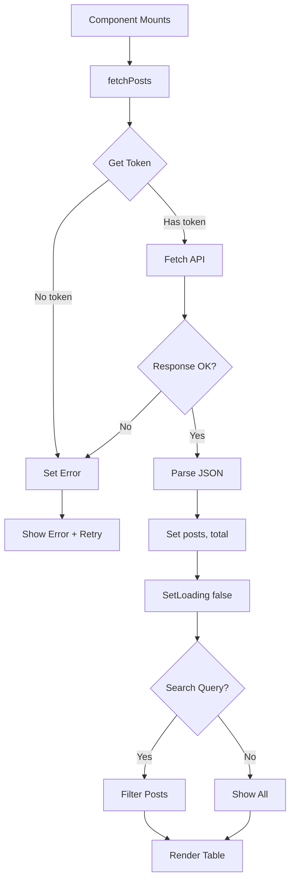

# Posts Simple Module

## Overview

This module provides a production-ready admin panel for managing blog posts using direct API calls (without Refine abstraction). It implements pagination, search, error handling, and comprehensive statistics display.

**Purpose**: Full-featured post management with direct REST API integration.

**Key Features**:
- Direct fetch API calls (no Refine dependency)
- Client-side pagination (20 items per page)
- Real-time search/filter by slug
- Loading and error states
- Responsive design with dark mode support
- Summary statistics dashboard
- External link preview functionality

## Component

### PostsListSimplePage

**Location**: `page.tsx`

**Purpose**: Complete post management interface with search, pagination, and statistics.

**Props**: None

**State Management**:
```typescript
const [posts, setPosts] = useState<any[]>([])        // Fetched posts
const [total, setTotal] = useState(0)                // Total count
const [loading, setLoading] = useState(true)         // Loading state
const [error, setError] = useState<string | null>(null)  // Error message
const [page, setPage] = useState(1)                  // Current page
const [pageSize] = useState(20)                      // Items per page (constant)
const [searchQuery, setSearchQuery] = useState('')   // Search filter
```

**Effects**:
1. Data fetching on page change
```typescript
useEffect(() => {
  fetchPosts()
}, [page])
```

## API Integration

### fetchPosts Function

**Endpoint**: `http://localhost:3000/v1/admin/posts`

**Method**: GET

**Authentication**: Bearer token from localStorage
```typescript
const token = localStorage.getItem('access_token')
headers: {
  'Authorization': `Bearer ${token}`,
  'Content-Type': 'application/json',
}
```

**Query Parameters**:
```typescript
{
  page: number,
  page_size: number
}
```

**Response Format**:
```typescript
{
  posts: Post[],
  total: number
}
```

**Error Handling**:
- No token → Error: "No authentication token found"
- HTTP errors → Error: "HTTP {status}: {statusText}"
- Network errors → Caught and displayed
- Retry functionality with "重试" button

## Data Structures

### Post Interface
```typescript
interface Post {
  slug: string
  view_count: number
  like_count: number
  comment_count: number
  updated_at: string  // ISO date string
}
```

## UI Components

### 1. Loading State
```typescript
<Loader2 className="w-8 h-8 animate-spin text-blue-600 dark:text-blue-400" />
```

### 2. Error State
- Red background banner
- Error message display
- Retry button

### 3. Search Bar
- Search icon (lucide-react Search)
- Real-time filtering by slug (case-insensitive)
- Responsive layout (flex-col on mobile, flex-row on desktop)

### 4. Posts Table
**Columns**:
1. **Article Slug** - FileText icon, post slug
2. **Statistics** - Eye, Heart, MessageSquare icons with counts
3. **Updated** - Formatted date (zh-CN locale)
4. **Actions** - Preview link (opens in new tab)

**Table Features**:
- Responsive overflow-x-auto
- Hover row highlighting
- Dark mode support
- Empty state handling

### 5. Pagination
- Previous/Next buttons
- Disabled state logic
- Item range display: "显示第 X 到 Y 条，共 Z 条"
- Conditional rendering (only if total > pageSize)

### 6. Summary Dashboard
**Three Statistics Cards**:
1. **Total Posts** - Total count
2. **Total Views** - Sum of all view_count
3. **Total Interactions** - Sum of likes + comments

## Styling

**Approach**: Tailwind CSS with dark mode variants

**Color Scheme**:
- Primary: Blue-600/Blue-400
- Error: Red-600/Red-400
- Success: Green
- Background: White/Gray-800 (dark)

**Dark Mode**: All components include `dark:` variants

**Responsive Design**:
- Mobile: Single column, stacked layout
- Desktop: Grid layouts (3 columns for stats)

**Spacing**: Consistent `space-y-6` vertical rhythm

## Search/Filter Logic

```typescript
const filteredPosts = posts.filter((post) => {
  return searchQuery === '' ||
    post.slug.toLowerCase().includes(searchQuery.toLowerCase())
})
```

**Behavior**:
- Client-side filtering (after API fetch)
- Case-insensitive substring match
- Empty query shows all posts

## Data Flow



## Error Handling

**Error States**:
1. **Authentication Error**: Missing access_token
2. **HTTP Error**: Non-200 status codes
3. **Network Error**: Fetch failures

**UI Feedback**:
- Red background banner (dark: red-900/20)
- Clear error message
- Retry button (重新获取)

**Retry Logic**:
```typescript
<button onClick={fetchPosts}>重试</button>
```

## Dependencies

### External
- `next/link` - Link component for external preview
- `lucide-react` - Icons (Search, Eye, Heart, MessageSquare, FileText, Loader2)

### Internal
- `@/lib/utils/logger` - Debug logging

## Logging

**Logger Usage**:
```typescript
logger.log('[PostsSimple] Received data:', data)
logger.error('[PostsSimple] Error:', err)
```

## Accessibility

**Features**:
- Semantic HTML (table, thead, tbody)
- Icon labels for visual context
- Disabled button states
- Color contrast (WCAG compliant)
- Loading indicators

## Performance Considerations

1. **Client-side filtering**: Efficient for small datasets
2. **useEffect dependencies**: Only re-fetches on page change
3. **Search debouncing**: Not implemented (could be added)
4. **Pagination limits**: Fixed 20 items per page

## Differences from posts-refine

| Feature | posts-refine | posts-simple |
|---------|-------------|--------------|
| Data fetching | Refine useList | Direct fetch |
| Pagination | Server-side | Server-side |
| Search | No | Yes (client-side) |
| Error handling | Basic | Comprehensive (retry) |
| Dark mode | No | Yes |
| Statistics | Basic table | Summary cards |
| Production ready | No (debug code) | Yes |

## Future Enhancements

- [ ] Server-side search/filter API
- [ ] Search debouncing (300ms)
- [ ] Bulk actions (delete, publish)
- [ ] Export to CSV
- [ ] Advanced filters (date range, status)
- [ ] Inline editing
- [ ] Drag-and-drop reordering
