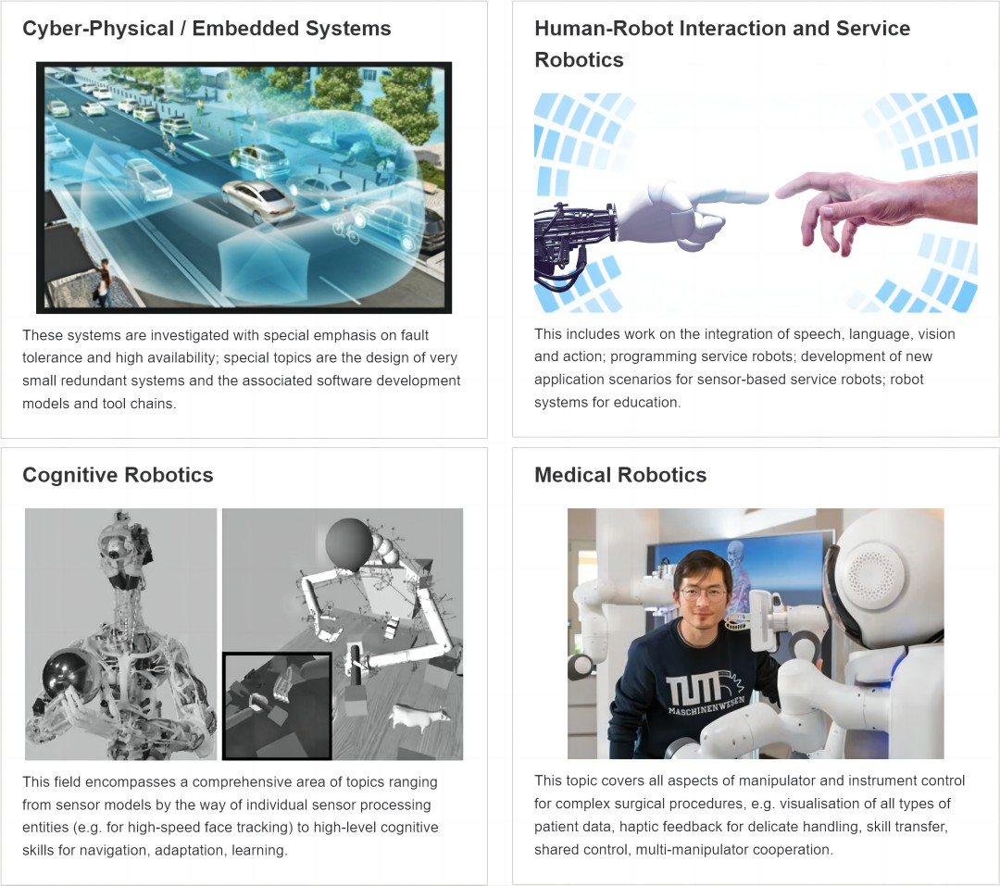
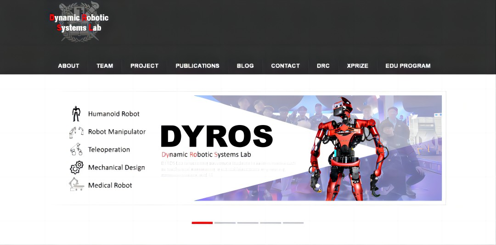
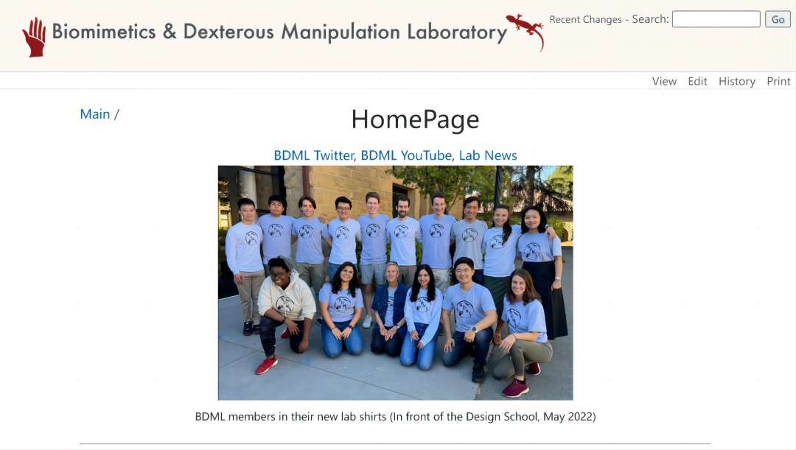

<FeatureCard
    color="dark"
    href="https://www.ce.cit.tum.de/air/home/"
    title="TUM"
    subTitle="Lehrstuhl für Robotik, Künstliche Intelligenz und Echtzeitsysteme"
    actionIcon="arrowRight"
    >
<ArtDirection>

</ArtDirection>
</FeatureCard>

<FeatureCard
    color="dark"
    href="https://github.com/PKU-EPIC"
    title="PKU"
    subTitle="Embodied Perception and InteraCtion (EPIC) Lab"
    actionIcon="arrowRight"
    >
<ArtDirection>

</ArtDirection>
</FeatureCard>

<FeatureCard
    color="dark"
    href="https://ericyi.github.io"
    title="THU"
    subTitle="3D VIsual Computing and machine Intelligence"
    actionIcon="arrowRight"
    >
<ArtDirection>

</ArtDirection>
</FeatureCard>

<FeatureCard
    color="dark"
    href="http://dyros.snu.ac.kr"
    title="SNU"
    subTitle="Dynamic Robotic Systems Lab"
    actionIcon="arrowRight"
    >
<ArtDirection>

</ArtDirection>
</FeatureCard>

<FeatureCard
    color="dark"
    href="http://bdml.stanford.edu/Main/HomePage"
    title="Stanford"
    subTitle="Biomimetics & Dexterous Manipulation Laboratory"
    actionIcon="arrowRight"
    >
<ArtDirection>

</ArtDirection>
</FeatureCard>

<FeatureCard
    color="dark"
    href="http://bdml.stanford.edu/Main/HomePage"
    title="Stanford"
    subTitle="Stanford Vision and Learning Lab"
    actionIcon="arrowRight"
    >
<ArtDirection>

</ArtDirection>
</FeatureCard>