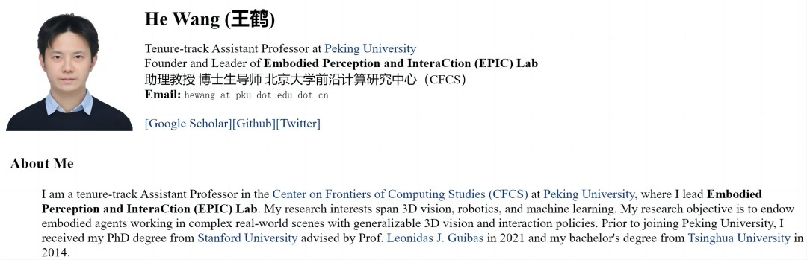

## 课题组
<FeatureCard
    color="dark"
    href="https://www.ce.cit.tum.de/air/home/"
    title="TUM"
    subTitle="Lehrstuhl für Robotik, Künstliche Intelligenz und Echtzeitsysteme"
    actionIcon="arrowRight"
    >
<ArtDirection>

</ArtDirection>
</FeatureCard>

<FeatureCard
    color="dark"
    href="https://github.com/PKU-EPIC"
    title="PKU"
    subTitle="Embodied Perception and InteraCtion (EPIC) Lab"
    actionIcon="arrowRight"
    >
<ArtDirection>

</ArtDirection>
</FeatureCard>
