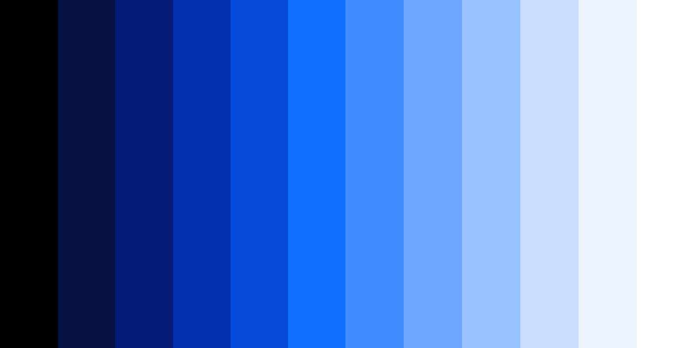

import HomepageTemplate from '../components/Homepage.js';
export default HomepageTemplate;

## 近期研究

<PageDescription>

The homepage content here lives in the `src/pages/index.mdx` directory at the
root of your project. Just like the other mdx pages, you can use all of our
theme components here without importing them. Review the
[MDX example source](https://github.com/carbon-design-system/gatsby-theme-carbon/blob/main/packages/example/src/pages/index.mdx).

</PageDescription>

<FeatureCard
    color="dark"
    href="/dexteroushand/introduction"
    title="灵巧手"
    actionIcon="arrowRight"
    className="homepage-feature"
    >

<ArtDirection>

</ArtDirection>

</FeatureCard>
